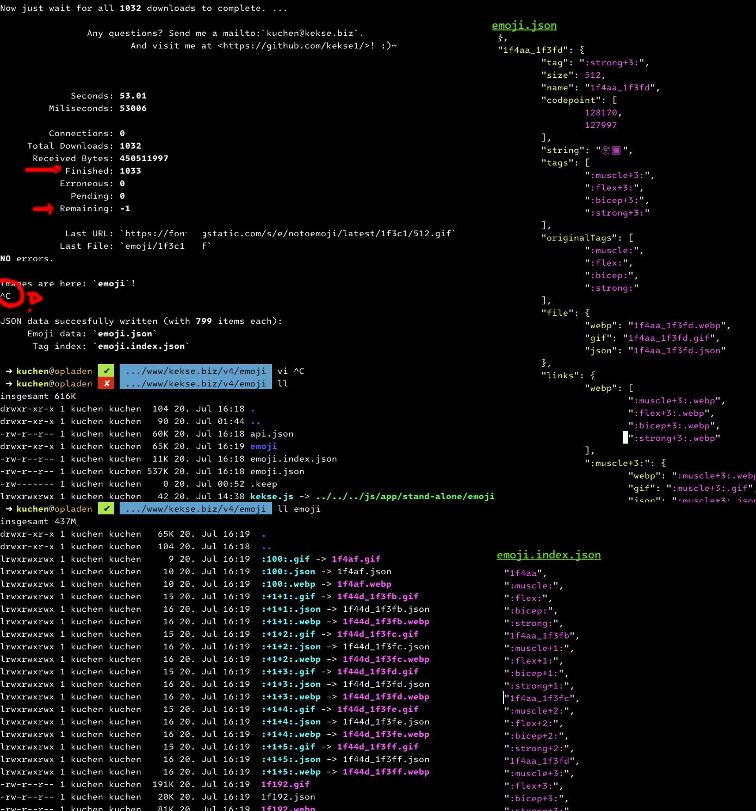

# Animated Emojis by Google
=> [Google: The hub for everything animated emoji!](https://googlefonts.github.io/noto-emoji-animation/)

This was a requested feature: as Google wasn't willing to allow users to mass download all the emojis at once,
in just one package.. you had to scroll through the list, select your emojis and then decide which one of three
image types (supported: **GIF**, **WebP** and **Lottie** (.json)).

But I didn't want to manually download them, I just wanted my own copy (for template/pre-precessor replacements),
so I hacked up a bit into the sources and quickly found everything necessary for this.

The mass download is really fast, as Google really wants users to request any icon every time on demand! :)~

### Download
[Here's the link for this **`kekse.emoji.js`**](src/kekse.emoji.js) (v**1.1.1**)!

## Features
For this moment I recommend you to **read the fucking source** for yourself. I'm going to explain it **l8rs**, j4u!

### Yet to come (TODO)
* Incremental download (checking `Content-Length` header against size of existing files); already prepared 4 it.
* `getopt.js` ('instead' of constants on top of file)

### News
* Fixed some less errors (but didn't update the [Preview Screenshot](docs/preview.png)..);

## Configuration
Located on (more/less) the top of this **[`kekse.emoji.js`](src/kekse.emoji.js)** script..

> **Note**
> My own **`getopt.js`** is _TODO_! ;)~

## Copyright and License
The Copyright is [(c) Sebastian Kucharczyk](COPYRIGHT.txt),
and it's licensed under the [MIT](LICENSE.txt) (also known as 'X' or 'X11' license).
