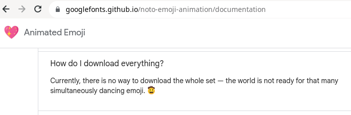
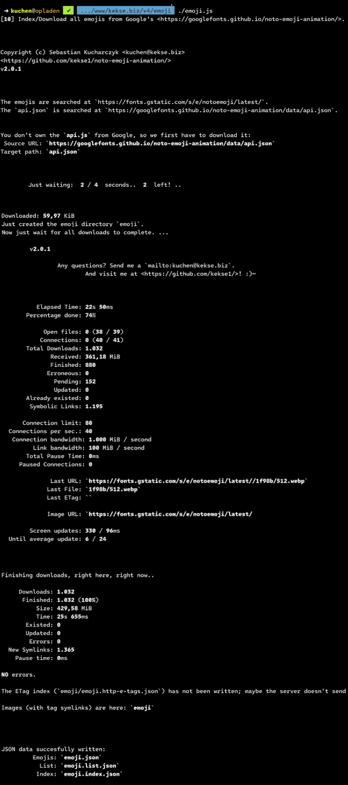

# Animated Emojis by Google
**=>** [**Google**: The hub for everything animated emoji!](https://googlefonts.github.io/noto-emoji-animation/)

This **ain't** a regular emoji website or smth. like this.. _here_ it's all about the [animated emojis available from
Google](https://googlefonts.github.io/noto-emoji-animation/); .. and one or two scripts which will 'use
them better'.. **so this ain't a regular site for emoji downloads! ^_^**

# Mass download (all emojis in one packet)
This was a requested feature: as Google wasn't willing to allow users to mass download all the emojis at once,
in just one packet.. you had to scroll through the list, select your emojis and then decide which one of three
image types (supported: **GIF**, **WebP** and **Lottie** (.json)).

But I didn't want to manually download them, I just wanted my own copy (for template/pre-precessor replacements),
so I hacked up a bit into the sources and quickly found everything necessary for this. And the mass download is
_really_ fast, as Google really wants users to request any icon every time on demand! :)~

So that's the reason for this [**`emoji.js`**](js/emoji.js) and [**`emoji.php`**](php/emoji.php). :)~

# **Tag Lookup**
My [**PHP** script](#php-script) is also there, just to request emojis by their tags (Google /seems/ to not
support it right now?). PLUS some other features! Check out the [**PHP** script section](#php-script)! :)~

And, jfyi, it works both in console and web browser requests.. see below.

I also published an example here (feel free to use this script right here, from my server, it'll relay to the original Google URL):
* [**`?tag=:zipper-face:&type=codepoint`**](https://mirror.kekse.biz/noto-emoji-animation/?tag=:zipper-face:&type=codepoint)
* [**`?tag=zipper-face&type=string&size=384`**](https://mirror.kekse.biz/noto-emoji-animation/?tag=zipper-face&type=string&size=384)
* [**`?tag=:zipper-face:&type=webp`**](https://mirror.kekse.biz/noto-emoji-animation/?tag=:zipper-face:&type=webp)
* [**`?tag=zipper-face&type=webp&size=192`**](https://mirror.kekse.biz/noto-emoji-animation/?tag=zipper-face&type=webp&size=192)

# Index
1. [Animated Emojis by Google](#animated-emojis-by-google)
2. [Mass download (all emojis in one packet)](#mass-download-all-emojis-in-one-packet)
3. [Tag Lookup](#tag-lookup)
4. [Downloads](#downloads)
5. [`.json` output](#json-output)
6. [Features](#features)
7. [Screenshot](#screenshot)
8. [Mirror](#mirror)
9. [Configuration](#configuration)
10. [PHP script](#php-script)
11. [Copyright and License](#copyright-and-license)

## Downloads
* [Here's the link for this **`emoji.js`**](js/emoji.js) v**2.1.0**;
* [And here's the **`emoji.php`**](php/emoji.php) v**2.1.0** (see the [**PHP** script section](#php-script));
* [A `.sh` starter/wrapper for the **PHP** script](php/emoji.sh);

> **Warning**
> Only tested in a **Linux** environment, so I'm not sure whether it'll all work w/ Windows OS..

## `.json` output
* [`emoji.json`](json/emoji.json)
* [`emoji.tags.json`](json/emoji.tags.json)
* [`emoji.index.json`](json/emoji.index.json)
* [`emoji.http-e-tags.json`](json/emoji.http-e-tags.json) [if the server supports this header variable];

## Features
* Locally existing emojis will be updated if a remote one has been updated (using the HTTP `ETag` header, or by comparing the `Content-Length`);
* All downloads are working asynchronous, and also every file operation (I really like efficiency ;)~
* Configurable downloads: maximum concurrent ones and limit on how many connections per second are initiated.
* The download rate can be limited.. both for each link and for all links together (the whole line).
* The images itself are stored in the same fs hierarchy like at the Google servers, so _image **mirroring**_ is possible.
* Additionally creates symbolic links to the images by all possible tags (to lookup tags, very important! ;)~
* Three `.json` output files are created (see the [**`.json`** output section](#json-output) below).
* And a fourth `.json` with the last `ETag` HTTP header values (if the server supports them);

.. for this moment I recommend you to .. **read the fucking source**! I'm going to explain more **l8rs*.*

## Screenshot
Downloads in progess:

## **Mirror**
I've mirrored Google's original.. That's only fair, because I published this mirroring alike script.. ;)~

* `api.json`: **https://mirror.kekse.biz/noto-emoji-animation/api.json**
* `emoji/`: **https://mirror.kekse.biz/noto-emoji-animation/emoji/**

## Configuration
Located on (more/less) the top of this **[`emoji.js`](js/emoji.js)** script..

> **Note**
> My own **`getopt.js`** is _TODO_! ;)~

## **PHP** script
Just made a [**PHP** script **`emoji.php`**](php/emoji.php) (v**2.1.0**).

This script runs either via web server request, or in CLI mode (command line interface). :)~
In CLI mode you've to define two parameters, whereas the first is the tag itself, the second is the type!
Otherwise call via browser like [...**`?tag=zipper-face&type=webp`**](https://mirror.kekse.biz/noto-emoji-animation/emoji.php?tag=zipper-face&type=webp),
or maybe [...**`?tag=:zipper-face:&type=string`**](https://mirror.kekse.biz/noto-emoji-animation/emoji.php?tag=:zipper-face:&type=string).. ;)~

> **Note**
> As a shebang is not supported here (because of the HTTPD mode), I just created a tiny shell script to start this `.php` script.
> See the **[`emoji.sh`](php/emoji.sh)**.

For direct emoji requests by emoji tags (like `:smile:`, etc.). _These_ ones are really **on demand**,
directly from the Google servers.

> **Warning**
> You need a copy of my **`emoji.index.json`** (which was meant for such cases like this script).
> Get it by using the **`emoji.js`** script itself!

These are the supported types to query for (2nd parameter in the command line argv[]):

| Key/Name      | Alias(es)     | Description/Comment                                                                |
| ------------: | :------------ | :--------------------------------------------------------------------------------: |
| **`test`**      | -/-           | Just return `0` or `1`, depending on the pure _existence_ of an emoji tag        |
| **`string`**    | `utf`, `utf8` | The unicode string representation of an emoji (the used font is maybe important) |
| **`codepoint`** | `code`        | The codepoint(s). If more than just one, they're separated by spaces (by default)|
| **`webp`**      | -/-           | The `WebP` image format (`image/webp`), designed by Google                       |
| **`gif`**       | -/-           | The old `GIF` format (`image/gif`); only 256 colors supported..                  |
| **`json`**      | `lottie`      | A newer **vector** format (`application/json`), n1!                              |

In the browser you'll automatically get relayed to the image/data itself;
in the console the link will just be shown.

_Only in the **browser**_: The _new_ GET[] parameter **`?size`** is available now, for:
* (**a**) Scaling up the `string` (w/ also new parameter **`?font`**, to also specify `font-family: 'Noto Emoji'`)
* (**b**) Putting the images (like `?type=webp`) into `` w/ size(s) css styles.. instead of only direct relay. ;)~

## Copyright and License
The Copyright is [(c) Sebastian Kucharczyk](COPYRIGHT.txt),
and it's licensed under the [MIT](LICENSE.txt) (also known as 'X' or 'X11' license).

The rest, everything on the Google servers (or smth. similar) is owned by Google, with their own license(s).
**I do NOT own anything which is coming from the Google servers, _also not my mirrored images_, etc.**.

I'm only the creator of everything available on this github site (up until https://github.com/kekse1/), etc..

