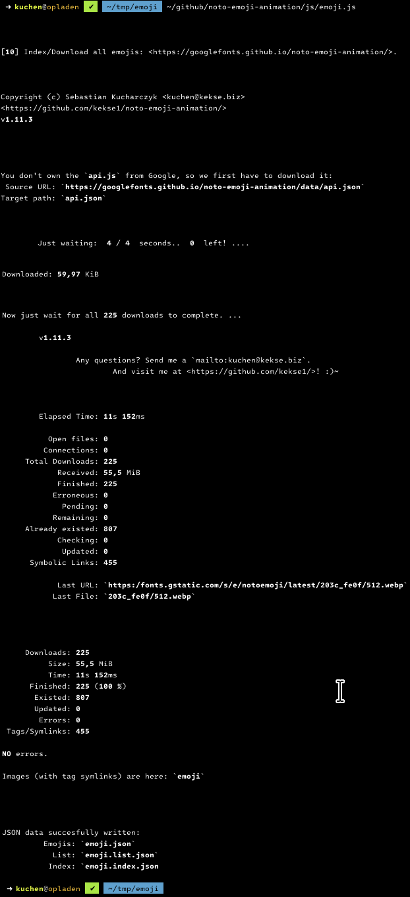

# Animated Emojis by Google
=> [Google: The hub for everything animated emoji!](https://googlefonts.github.io/noto-emoji-animation/)

This was a requested feature: as Google wasn't willing to allow users to mass download all the emojis at once,
in just one package.. you had to scroll through the list, select your emojis and then decide which one of three
image types (supported: **GIF**, **WebP** and **Lottie** (.json)).

But I didn't want to manually download them, I just wanted my own copy (for template/pre-precessor replacements),
so I hacked up a bit into the sources and quickly found everything necessary for this.

The mass download is really fast, as Google really wants users to request any icon every time on demand! :)~

## **Tag Lookup**
My [**PHP** script](#php-script) is also there, just to request emojis by their tags (Google doesn't support
this right now).

It works both in console and web browser requests.. see the section below.

## Download
* [Here's the link for this **`emoji.js`**](js/emoji.js) (v**1.7.1**);
* [And here's the **`emoji.php`**](php/emoji.php) (see the [**PHP** script section](#php-script));
* [A `.sh` starter for the **PHP** script](php/emoji.sh);

## Features
* Existing emojis will cause a check if there's a newer version available (parallel to the downloads)
* All downloads are working asynchronous, and also every file operation!
* Configurable downloads: maximum concurrent/parallel ones and how many connections per second
* The image files itself are stored in the same hierarchy like Google choosed; so _image **mirroring**_ is possible.
* A _**TAG** INDEX_ not only in `.json`, but also in the **`tag/` directory**. Full of **symbolic links** to lookup for!
* Three `.json` output files are created, see above at [**`.json`** output](#json-output).

*But .. for this moment I recommend you to **read the fucking source** for yourself. I'm going to explain it **l8rs**!*

### News
* The [Emoji **PHP** Script](#php-script) seems to be finished now (works both in console and the web browser)!
* **Additive** downloading: Now checking if a file already exists, then omitting it's download!
* Some changes in the format of the resulting `.json` outputs, and now with a **third** JSON output file.
* Fixed some less errors (but didn't update the [Preview Screenshot](docs/screenshot.png)..);
* Prevent flimmering in the status output
* Changed the resulting fs hierarchy, and minor .json changes

### Yet to come (TODO)
* Incremental download by checking `Content-Length` header, to update outdated files!!
* `getopt.js` ('instead' of constants on top of file)

## **`.json`** output
* [`emoji.json`](json/emoji.json)
* [`emoji.index.json`](json/emoji.index.json)
* [`emoji.ref.json`](json/emoji.ref.json)

## Screenshot
Just _downloading_ the images:

## Configuration
Located on (more/less) the top of this **[`kekse.emoji.js`](js/emoji.js)** script..

> **Note**
> My own **`getopt.js`** is _TODO_! ;)~

## **PHP** script
Just made a [**PHP** script **`emoji.php`**](php/emoji.php) (v**2.0.0**).

> **Note**
> This script runs either via web server request, or in CLI mode (command line interface). :)~
> In CLI mode you've to define two parameters, whereas the first is the tag itself, the second is the type!
> Otherwise call via browser like **...`?tag=:smile:&type=test`**. ;)~

> **Note**
> As a shebang is not supported here (because of the HTTPD mode), I just created a tiny shell script to start this `.php` script.
> See the **[`emoji.sh`](php/emoji.sh)**.

For direct emoji requests by emoji tags (like `:smile:`, etc.). _These_ ones are really **on demand**, directly from the Google servers.

> **Warning**
> You need a copy of my **`emoji.ref.json`** (which was meant for such cases like this script).
> Get it by using the **`emoji.js`** script, presented on top of this github page.. ;)~

These are the supported types to query for (2nd parameter in the command line argv[]):

| Key/Name      | Alias(es)     | Description/Comment                                                                |
| ------------: | :------------ | :--------------------------------------------------------------------------------: |
| **`test`**      | -/-           | Just return `0` or `1`, depending on the pure _existence_ of an emoji tag        |
| **`string`**    | `utf`, `utf8` | The unicode string representation of an emoji (the used font is maybe important) |
| **`codepoint`** | `code`        | The codepoint(s). If more than just one, they're separated by spaces (by default)|
| **`webp`**      | -/-           | The `WebP` image format (`image/webp`), designed by Google                       |
| **`gif`**       | -/-           | The old `GIF` format (`image/gif`); only 256 colors supported..                  |
| **`json`**      | `lottie`      | A newer **vector** format (`application/json`), n1!                              |

In the browser you'll automatically get relayed to the image/data itself; in the console the URL will only be printed out.

## Copyright and License
The Copyright is [(c) Sebastian Kucharczyk](COPYRIGHT.txt),
and it's licensed under the [MIT](LICENSE.txt) (also known as 'X' or 'X11' license).

